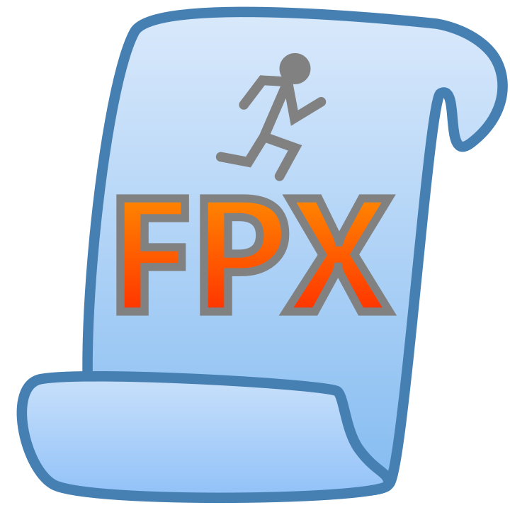

# FPX

FPX is a lightweight, high-performance first-person camera and movement controller for Roblox designed as a direct alternative to Roblox’s bloated `PlayerModule`. 
It works seamlessly across **all platforms** (PC, mobile, VR) and is designed with performance and server-authoritative support in mind.

> FPX runs by itself — there are no methods to call. It operates directly on the humanoid and camera through low-level hooks and upvalue manipulation.

---

## Features

- ⚡ Lightweight & optimized
- 🎮 PC, Mobile, Gamepad, and VR support
- 🔒 Fully server-authoritative movement support
- 👻 Autonomous system — no setup code required
- 🧠 Direct low-level camera & movement handling
- 🚀 Fast input processing with minimal latency
- 📦 Single-drop installation
- 🛠 Minimal runtime overhead

---

## How It Works

FPX directly interfaces with:
- `Humanoid`
- `HumanoidRootPart`
- Camera
- Input signals
- Render pipeline

It automatically handles:
- Mouse & keyboard
- Touch controls
- Gamepad
- VR
- Jumping
- Camera rotation
- Movement replication

All without requiring API calls or manual initialization.

---

## Installation

1. Place FPX into ReplicatedStorage
2. Done. 

---

## Configuration

- **Sensitivity** can be tweaked by editing the `Sensativity` upvalue in the script.  
- **Hidden parts** can be configured by editing `HiddenParts` for invisibility logic.  

> FPX is designed to be minimal and autonomous—direct configuration via exposed variables is the only supported customization.

---

## Why FPX?

Roblox’s default `PlayerModule` prioritizes abstraction and general-purpose architecture.

FPX prioritizes:

- Performance
- Predictable execution
- Minimal overhead
- Direct control
- Server-authoritative gameplay

The goal is simple:
> Remove unnecessary layers between player input and movement execution.

## Design Philosophy

FPX follows several core principles:
- Maximum optimization
- Minimal abstraction
- Autonomous execution
- Low allocation pressure
- Direct execution paths
- Cross-platform consistency

---

## Current Status

✅ Fully working
✅ Server-authoritative support implemented
✅ Cross-platform support implemented
✅ Autonomous initialization complete

---

## License

Apache License 2.0 © 2026 Yarik_superpro  
Use freely, optimize ruthlessly, and respect the core design philosophy.

---

## Contact

- Roblox: `Yarik_superpro`  
- Discord: `yarik_pro`
- DevForum: https://devforum.roblox.com/t/fpx-%E2%80%93-lightweight-playermodule-replacement-for-first-person-server-ready/4409000
